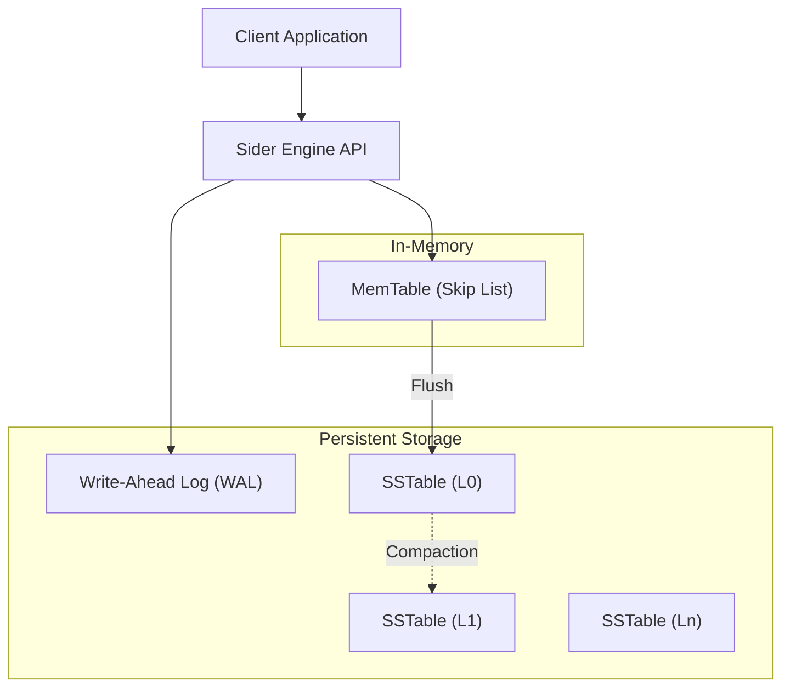

# SIDER DB(Read SIDER from the right and see the fun)

<div align="center">

**High-Performance, LSM-Tree Key-Value Store**

[](https://go.dev/)
[](LICENSE)
[](https://github.com/AgnibhaRay/sider)
[](https://github.com/AgnibhaRay/sider)

*Persistent • ACID Compliant • Dependency-Free*

```ascii
╔═══════════════════════════════════════════════════════════╗
║  ⚡ Sub-millisecond Latency |  🔒 Data Integrity  |  🎯 Zero Dependencies  ║
╚═══════════════════════════════════════════════════════════╝
```

</div>

---

## 📖 Overview

**Sider** is an embedded, persistent key-value store engineered for high-throughput and low-latency workloads. Built on the **Log-Structured Merge-Tree (LSM-Tree)** architecture, Sider provides a robust storage solution that balances write performance, read efficiency, and data durability.

Designed with a philosophy of minimalism and reliability, Sider eliminates external dependencies, offering a single-binary deployment model ideal for embedded systems, edge computing, and high-performance caching layers. It incorporates advanced storage engine features including **Bloom Filters**, **Write-Ahead Logging (WAL)**, and **Tombstone-based Deletions** to ensure enterprise-grade data integrity and performance.

---

## 🚀 Core Capabilities

### ⚡ High-Performance Storage Engine
- **LSM-Tree Architecture**: Optimized for write-heavy workloads by converting random writes into sequential disk I/O.
- **Skip List MemTable**: Provides $O(\log n)$ time complexity for in-memory insertions and lookups.
- **Bloom Filters**: Probabilistic data structures integrated into SSTables to reduce unnecessary disk reads by over 90%.
- **Compaction**: Merges multiple SSTables into a single optimized file, reclaiming space by removing overwritten data and deleted keys (tombstones).

### 🛡️ Data Durability & Integrity
- **Write-Ahead Logging (WAL)**: Ensures atomicity and durability. All operations are persisted to an append-only log before memory modification, guaranteeing zero data loss on crash recovery.
- **Crash Recovery**: Automatic log replay mechanism restores the database state to the last committed transaction upon restart.
- **ACID Compliance**: Guarantees Atomicity, Consistency, Isolation, and Durability for single-key operations.

### 📦 Operational Simplicity
- **Zero Dependencies**: Written in pure Go, requiring no external libraries or C bindings.
- **Embeddable**: Designed to be linked directly into Go applications or run as a standalone lightweight service.
- **Tombstone Deletions**: Implements logical deletions via tombstones, ensuring correct behavior in a versioned storage system.

---

## 🏗️ System Architecture

Sider employs a tiered storage architecture designed to maximize resource utilization and performance.



### Component Breakdown

| Component | Implementation Details | Role |
|-----------|------------------------|------|
| **MemTable** | Skip List (Probabilistic Balancing) | Buffers writes in memory for fast access. Supports concurrent reads. |
| **WAL** | Append-Only File | Persists operations for crash recovery. Truncated upon successful MemTable flush. |
| **SSTable** | Immutable Sorted File | On-disk storage format. Contains sorted Key-Value pairs and a Bloom Filter block. |
| **Bloom Filter** | Bitset (FNV-1a Hash) | Space-efficient structure to test set membership, minimizing disk I/O for non-existent keys. |

---

## 💻 Getting Started

### Prerequisites
- **Go 1.20** or higher
- POSIX-compliant file system (for data persistence)

### Installation

```bash
git clone https://github.com/AgnibhaRay/sider.git
cd sider
go build -o sider main.go
```

### CLI Usage

Sider includes a built-in CLI for direct interaction with the database engine.

```bash
$ ./sider

========================================
   SIDER DB (Advanced LSM Engine)      
   Version: 1.0.0                      
   Author:  AgnibhaRay                 
   Now with Compaction!                
========================================
Commands: put <k> <v> | get <k> | del <k> | compact | exit

sider> put user_123 {"name": "Alice", "role": "admin"}
OK

sider> get user_123
"{\"name\": \"Alice\", \"role\": \"admin\"}"

sider> del user_123
OK (Tombstone written)

sider> get user_123
(nil)
```

---

## 🔬 Internal Mechanics

### Write Path
1.  **Log**: The operation is appended to the **WAL** to ensure durability.
2.  **Insert**: The key-value pair is inserted into the **MemTable** (Skip List).
3.  **Flush**: When the MemTable exceeds the configured threshold (`MemtableLimit`), it is frozen and flushed to disk as an **SSTable**.
4.  **Cleanup**: The WAL is truncated, and a new MemTable is initialized.

### Read Path
1.  **Memory Lookup**: The engine queries the **MemTable**. If found, the value is returned immediately.
2.  **Disk Lookup**: The engine iterates through **SSTables** in reverse chronological order (newest to oldest).
    *   **Bloom Filter Check**: Before reading the file, the Bloom Filter is queried. If it returns negative, the file is skipped.
    *   **File Scan**: If the Bloom Filter returns positive, the SSTable is scanned for the key.

### Deletion Strategy
Deletions in LSM-Trees are handled via **Tombstones**. A delete operation writes a special marker record. During read operations, a tombstone shadows older versions of the key. Permanent removal of data occurs during the compaction process.

### Compaction Strategy
Sider implements a manual compaction mechanism that:
1.  **Merges** all existing SSTables into a single, new SSTable.
2.  **Dedupes** keys, keeping only the latest version.
3.  **Purges** tombstones, permanently removing deleted data.
4.  **Rebuilds** the Bloom Filter for the new compacted file.

---

## ⚙️ Configuration & Tuning

Configuration constants are defined in `main.go` and can be adjusted for specific workload requirements.

```go
const (
    WALFile         = "sider.wal"     // Path to Write-Ahead Log
    DataDir         = "data"          // Directory for SSTables
    MemtableLimit   = 1000            // Threshold for flushing to disk
    BloomFilterSize = 4096            // Size of Bloom Filter (bytes)
)
```

| Parameter | Recommendation | Impact |
|-----------|----------------|--------|
| `MemtableLimit` | Increase for write-heavy loads | Reduces flush frequency but increases memory usage and recovery time. |
| `BloomFilterSize` | Increase for large datasets | Reduces false positive rate, improving read performance for non-existent keys. |

---

## 📊 Performance Characteristics

| Operation | Time Complexity | Notes |
|-----------|-----------------|-------|
| **Put** | $O(\log N)$ | Dominated by Skip List insertion and sequential WAL write. |
| **Get** | $O(\log N)$ (Mem) + $O(K)$ (Disk) | $K$ is the number of SSTables. Bloom Filters significantly reduce $K$ in practice. |
| **Delete** | $O(\log N)$ | Identical to Put (writes a Tombstone). |
| **Space** | $O(N)$ | Linear space complexity. Compaction is required to reclaim space from updates/deletes. |

---

## 🗺️ Roadmap

- [x] **Core Engine**: LSM-Tree, WAL, Skip List, SSTables.
- [x] **Optimization**: Bloom Filters, Tombstone Deletions.
- [x] **Compaction**: Manual compaction strategy for space reclamation.
- [ ] **Compression**: Block-level compression (Snappy/Zstd).
- [ ] **API**: gRPC/HTTP interface for remote access.
- [ ] **Observability**: Prometheus metrics and structured logging.

---

## 🤝 Contribution

Contributions are welcome from the community. Please adhere to the following guidelines:

1.  **Fork & Clone**: Create a personal fork of the repository.
2.  **Branch**: Create a feature branch (`git checkout -b feature/optimization`).
3.  **Test**: Ensure all existing tests pass and add new tests for your feature.
4.  **Commit**: Use conventional commit messages.
5.  **Pull Request**: Submit a detailed PR description.

---

## 📄 License

This project is licensed under the **MIT License**. See the [LICENSE](LICENSE) file for details.

---

<div align="center">

**Engineered by [AgnibhaRay](https://github.com/AgnibhaRay)**

[Report Issue](https://github.com/AgnibhaRay/sider/issues) • [Request Feature](https://github.com/AgnibhaRay/sider/issues)

</div>