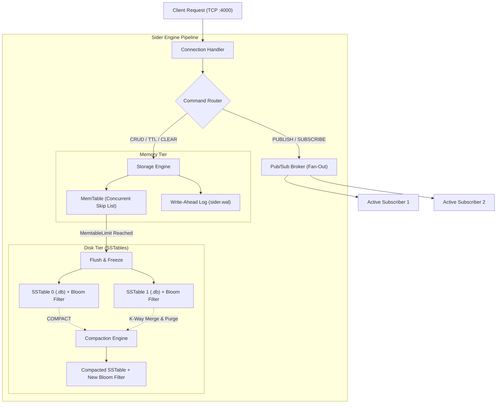

<p align="center">
  
</p>

<div align="center">

```
  ____  ___ ____  _____ ____  
 / ___||_ _|  _ \| ____|  _ \ 
 \___ \ | || | | |  _| | |_) |
  ___) || || |_| | |___|  _ < 
 |____/|___|____/|_____|_| \_\  DB
```

### ⚡ SIDER v2: The Ultra-Fast, LSM-Tree Persistent Key-Value Store & Real-Time Engine ⚡
*(Hint: Read **SIDER** backwards and see the fun 😉)*

[](https://github.com/AgnibhaRay/sider/releases/tag/v2.0.0)
[](https://go.dev/)
[](https://github.com/AgnibhaRay/sider/actions)
[](LICENSE)
[](https://github.com/AgnibhaRay/sider)
[](Dockerfile)
[](go.mod)

<br/>

**[What's New in v2](#-whats-new-in-sider-v2)** •
**[Features](#-key-features)** •
**[Architecture](#-system-architecture)** •
**[Command Reference](#-protocol--command-reference)** •
**[Quick Start](#-quick-start)** •
**[Client Libraries](#-client-libraries--drivers)** •
**[Benchmarks](#-performance--complexity)** •
**[Docker & Cloud](#-deployment--docker)**

<br/>

```text
╔═════════════════════════════════════════════════════════════════════════════════╗
║  ⚡ Sub-Millisecond Latency  •  🔒 WAL Durability  •  ⏱️ Persistent TTL         ║
║  📡 Built-in Pub/Sub Engine  •  🎯 Bloom Filters   •  📦 Single-Binary Go Engine ║
╚═════════════════════════════════════════════════════════════════════════════════╝
```

</div>

---

## 🚀 What's New in Sider v2

Sider v2 is a major leap forward from a standalone LSM storage engine into a production-ready, durable alternative to Redis:

- ⏱️ **Durable Key Expiration (TTL)**: Nanosecond-precision Unix timestamp binary encoding embedded into WAL entries and SSTables (`PUTEX`, `EXPIRE`, `TTL`). Expiry survives crashes, flushes, and compactions.
- 📡 **Built-in Streaming Pub/Sub Broker**: Thread-safe channel-based publisher and subscriber fan-out over active client TCP connections (`SUBSCRIBE`, `UNSUBSCRIBE`, `PUBLISH`).
- 🧹 **Prefix-based Invalidation**: Batch-clear entire key namespaces in memory and on disk with `CLEAR <prefix>`, ideal for multi-tenant cache invalidation.
- 🧪 **Full Test Coverage & CI**: Integrated Go unit & integration test suite verifying SkipList concurrency, Bloom filter bounds, and Pub/Sub pipelines.
- ☕ **Production Multi-Language Clients**: Production-ready Java (Spring Boot Cache & PubSub) and Python interactive drivers.

---

## 🌟 Overview

**Sider** is a high-performance, embedded & networked key-value database built from scratch around a **Log-Structured Merge-Tree (LSM-Tree)** architecture. Designed as a lean, durable, and persistent alternative to Redis, Sider combines the high read/write throughput of memory with the rock-solid durability of sequential disk storage.

Traditional in-memory data stores require massive RAM overhead and complex snapshotting (RDB/AOF). **Sider flips the paradigm**: writes land instantly in a Write-Ahead Log (WAL) and an in-memory **Skip List MemTable**, before being flushed into immutable, **Bloom Filter-indexed SSTables** on disk with background deduplication and compaction.

With native **durable TTL expiration**, **prefix namespace purging**, and a low-latency **streaming Pub/Sub broker**, Sider is built for high-throughput caching, event dispatching, and distributed microservices.

---

## 🚀 Key Features

| Capability | Technical Implementation | Value to Developers |
| :--- | :--- | :--- |
| **⚡ High Write Throughput** | LSM-Tree sequential append writes | Eliminates random disk write penalties entirely. |
| **🛡️ Zero-Loss Durability** | Synchronous Write-Ahead Logging (WAL) | Recovers instantaneously after unannounced crashes or power loss. |
| **🔍 90%+ Disk I/O Skip** | BitSet Bloom Filters (FNV-1a Hash) | Non-existent keys are caught before touching the disk. |
| **⏱️ Durable TTL Expiry** | 8-byte Unix timestamp binary packing | Expiration survived node restarts and SSTable compactions (`PUTEX`, `EXPIRE`, `TTL`). |
| **📡 Real-Time Pub/Sub** | Multiplexed non-blocking TCP broker | Stream notifications & alerts to thousands of subscribers (`PUBLISH`, `SUBSCRIBE`). |
| **🧹 Bulk Cache Invalidation**| Prefix scanning iterator (`CLEAR`) | Invalidate tenant or entity cache partitions with a single command. |
| **🗜️ Disk Space Compaction** | K-Way merge with Tombstone collection | Dedupes obsolete updates and frees up disk space seamlessly. |
| **🪶 Zero Dependencies** | Pure Standard Library Go | Single static executable with zero C-bindings or runtime dependencies. |

---

## 🏗️ System Architecture


```mermaid
graph TD
    Client["Client Request (TCP :4000)"] --> Conn["Connection Handler"]
    
    subgraph "Sider Engine Pipeline"
        Conn --> Broker{"Command Router"}
        Broker -- "PUBLISH / SUBSCRIBE" --> PS["Pub/Sub Broker (Fan-Out)"]
        Broker -- "CRUD / TTL / CLEAR" --> Engine["Storage Engine"]
        
        subgraph "Memory Tier"
            Engine --> MemTable["MemTable (Concurrent Skip List)"]
            Engine --> WAL["Write-Ahead Log (sider.wal)"]
        end

        subgraph "Disk Tier (SSTables)"
            MemTable -- "MemtableLimit Reached" --> Flush["Flush & Freeze"]
            Flush --> SSTable0["SSTable 0 (.db) + Bloom Filter"]
            Flush --> SSTable1["SSTable 1 (.db) + Bloom Filter"]
            SSTable0 -. "COMPACT" .-> Compactor["Compaction Engine"]
            SSTable1 -. "K-Way Merge & Purge" .-> Compactor
            Compactor --> SSTMerged["Compacted SSTable + New Bloom Filter"]
        end
    end

    PS --> Sub1["Active Subscriber 1"]
    PS --> Sub2["Active Subscriber 2"]
```

### The Read & Write Lifecycle

```
WRITE PATH : Client ──► WAL (Disk Append) ──► MemTable (Skip List O(log N)) ──► [Flush to SSTable on Limit]
                                                                                       │
READ PATH  : Client ──► MemTable Check ──► SSTable Bloom Filter Check ──► SSTable Binary Search ──► Return
```

1. **Write Path**: Operations append to `sider.wal` in sequential binary format first. The key-value record is then inserted into the Skip List MemTable in $O(\log N)$.
2. **Read Path**: The MemTable is checked first. If missing, SSTables are checked in reverse chronological order. Each SSTable's embedded Bloom filter is evaluated in memory—if negative, disk reads are skipped completely!
3. **Deletions & Expirations**: Logical tombstones and Unix-epoch binary TTL prefixes guarantee consistency across flushes, crash-recovery, and background compactions.

---

## 📋 Protocol & Command Reference

Sider uses a clean, line-delimited ASCII protocol over TCP (port `4000`), making it compatible with `netcat`, `telnet`, or any custom TCP socket client.

### Core Key-Value Operations

| Command | Arguments | Description | Example Response |
| :--- | :--- | :--- | :--- |
| `PUT` | `<key> <val>` | Store key-value pair persistently | `OK` |
| `GET` | `<key>` | Fetch value by key | `<value>` or `(nil)` |
| `DEL` | `<key>` | Write tombstone deletion | `OK` |
| `PUTEX` | `<key> <ttl-sec> <val>` | Store key-value with TTL in seconds | `OK` |
| `EXPIRE` | `<key> <ttl-sec>` | Update or attach TTL to existing key | `1` (success) / `0` (not found) |
| `TTL` | `<key>` | Get remaining time to live | Remaining seconds, `-1` (no TTL), `-2` (expired/absent) |
| `CLEAR` | `<prefix>` | Evict all keys matching prefix | `CLEARED <count>` |
| `COMPACT` | *none* | Trigger asynchronous SSTable merge | `OK Compact Started` |

### Pub/Sub Messaging Operations

| Command | Arguments | Description | Example Response |
| :--- | :--- | :--- | :--- |
| `SUBSCRIBE` | `<channel>` | Register socket to channel event stream | `SUBSCRIBED <channel>` |
| `UNSUBSCRIBE` | `<channel>` | Deregister socket from channel | `UNSUBSCRIBED <channel>` |
| `PUBLISH` | `<channel> <msg>` | Broadcast message to all channel subscribers | `PUBLISHED <subscriber-count>` |

> **Subscriber Streaming Format**: When a message is published, subscribers receive `MESSAGE <channel> <message>\n` directly on their TCP stream.

---

## 🏁 Quick Start

### 1. Build & Run from Source

```bash
# Clone the repository
git clone https://github.com/AgnibhaRay/sider.git
cd sider

# Build the native binary
go build -o sider main.go

# Start the server (default port :4000)
./sider
```

```
========================================
   SIDER SERVER LISTENING ON :4000   
   Version: 2.0.0                      
   Author:  AgnibhaRay                 
========================================
```

### 2. Interactive Terminal (`netcat`)

```bash
$ nc localhost 4000
PUT greeting "Hello World"
OK
GET greeting
"Hello World"

PUTEX auth:token 300 "jwt-xyz"
OK
TTL auth:token
299

CLEAR auth:
CLEARED 1
```

---

## 💻 Client Libraries & Drivers

Sider includes first-class drivers for multiple languages:

### 🐍 Python (`py-driver.py`)

```python
from sider import SiderClient

client = SiderClient("localhost", 4000)

# Set with 60-second expiration
client.put_with_ttl("session:user_42", 60, '{"role": "admin"}')

# Read value
session = client.get("session:user_42")
print(f"Session: {session}")

# Check TTL
ttl = client.ttl("session:user_42")
print(f"Expires in: {ttl}s")

# Publish event
client.publish("user-events", "user_42_logged_in")
```

### ☕ Java CLI & Spring Boot (`SiderCLI.java`)

```java
SiderClient client = new SiderClient("localhost", 4000);

// Key-Value with TTL
client.putWithTtl("cache:product:99", 600, "{price: 29.99}");

// Pub/Sub Listener
new Thread(() -> {
    client.subscribe("order-alerts", message -> {
        System.out.println("Received order: " + message);
    }, () -> true);
}).start();

// Publish
client.publish("order-alerts", "ORDER_CREATED_#1042");
```

---

## 🩸 Real-World Application: PulseNode

Sider is the production-grade caching and real-time message bus powering **[PulseNode](https://github.com/AgnibhaRay/PulseNode)**, an emergency blood dispatch and donor matching platform.

- **Unified Layer**: Replaced Redis completely for Spring Boot cache management (`@Cacheable`) and low-latency emergency donor broadcast channels.
- **Prefix Clearing**: Enables instant invalidation of hospital and donor search caches (`CLEAR pulse-cache-donors-`).
- **Resilient Pub/Sub**: Connects emergency hospital dispatchers with automatic reconnect loops and zero packet loss.

---

## 🐳 Deployment & Docker

### Run with Docker

```bash
# Build Docker image
docker build -t sider:latest .

# Run container with volume persistence
docker run -d \
  -p 4000:4000 \
  -v $(pwd)/data:/root/data \
  --name sider-db \
  sider:latest
```

### Docker Compose

```yaml
version: '3.8'

services:
  sider:
    image: sider:latest
    build: .
    ports:
      - "4000:4000"
    volumes:
      - sider-data:/root/data
    restart: always

volumes:
  sider-data:
```

### Azure Container Apps

```bash
az containerapp up \
  --name sider-db \
  --resource-group rg-sider \
  --image <your-registry>.azurecr.io/sider:latest \
  --target-port 4000 \
  --ingress external
```

---

## 📊 Performance & Complexity

| Operation | Memory Time | Disk Time | Space Complexity |
| :--- | :--- | :--- | :--- |
| `PUT` / `PUTEX` | $O(\log N)$ (Skip List) | $O(1)$ (Append WAL) | $O(1)$ per key |
| `GET` (Cache Hit) | $O(\log N)$ | $O(0)$ (Bypassed) | — |
| `GET` (Cache Miss) | $O(\log N)$ | $O(1)$ Bloom Filter + $O(\log M)$ SSTable | — |
| `DEL` | $O(\log N)$ (Tombstone) | $O(1)$ (Append WAL) | Reclaimed in Compaction |
| `CLEAR` | $O(K)$ matching keys | $O(K)$ Tombstone writes | Reclaimed in Compaction |
| `PUBLISH` | $O(S)$ subscribers | $O(0)$ (In-Memory) | Zero disk overhead |

---

## 🧪 Testing & Verification

Sider maintains a comprehensive Go test suite covering Skip List balancing, Bloom Filter false-positive boundaries, durable TTL transitions, prefix deletion, and concurrent multi-client pub/sub broadcasting:

```bash
$ go test -v ./...
=== RUN   TestBloomFilter
--- PASS: TestBloomFilter (0.00s)
=== RUN   TestEngineBasicCRUD
--- PASS: TestEngineBasicCRUD (0.00s)
=== RUN   TestEngineTTL
--- PASS: TestEngineTTL (0.14s)
=== RUN   TestEngineClearPrefix
--- PASS: TestEngineClearPrefix (0.00s)
=== RUN   TestBrokerPubSub
--- PASS: TestBrokerPubSub (0.00s)
PASS
ok      sider   0.920s
```

---

## 🗺️ Roadmap

- [x] **LSM-Tree Core Engine**: Skip List MemTable, WAL, and immutable SSTables.
- [x] **Bloom Filter Optimization**: 1024-byte BitSet with FNV-1a hash reduction.
- [x] **Durable TTL & Expiration**: Persisted expiration timestamps across crashes and compactions.
- [x] **Streaming Pub/Sub Broker**: Multi-channel subscription and live event dispatching.
- [x] **Prefix Namespacing (`CLEAR`)**: Instant batch cache eviction.
- [ ] **Block-level Compression**: Snappy / Zstandard compression for SSTables on disk.
- [ ] **Leveled Compaction (LSM Tiering)**: Multi-level LSM hierarchy (Level 0 through Level N).
- [ ] **Prometheus Metrics Exporter**: Native `:9090/metrics` endpoint for latency and disk stats.

---

## 🤝 Contributing

Contributions, issues, and feature requests are welcome!

1. Fork the Project
2. Create your Feature Branch (`git checkout -b feature/AmazingFeature`)
3. Commit your Changes (`git commit -m 'Add some AmazingFeature'`)
4. Push to the Branch (`git push origin feature/AmazingFeature`)
5. Open a Pull Request

---

## 📄 License

Distributed under the **MIT License**. See [`LICENSE`](LICENSE) for more information.

<div align="center">

<br/>

Designed & Engineered with ❤️ by **[Agnibha Ray](https://github.com/AgnibhaRay)**

[⭐ Star on GitHub](https://github.com/AgnibhaRay/sider) • [🐛 Report Bug](https://github.com/AgnibhaRay/sider/issues) • [💡 Request Feature](https://github.com/AgnibhaRay/sider/issues)

</div>
